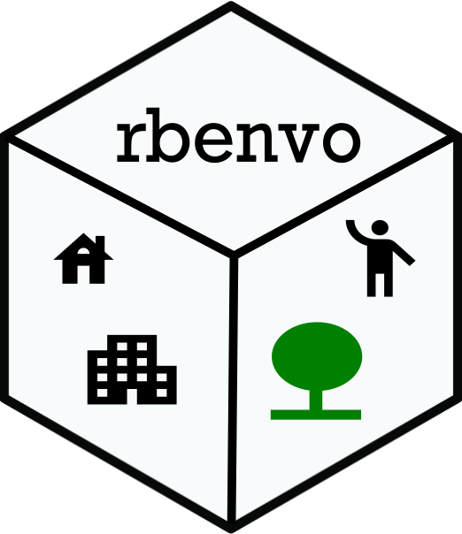

##  `rbenvo`: Built Environment Objects for Point Pattern Data in R
<!-- badges: start -->
[](https://www.gnu.org/licenses/gpl-3.0)
[](https://travis-ci.org/apeterson91/rbenvo)
<!-- badges: end -->

## About

rbenvo is package that creates S4 class objects and methods for
built environment data to ease the use of working with these data 
and improve interoperability with other R packages developing methods in this 
same space.


## Installation

### Development Version

 Currently this package is only available via Github. In order to install the software use the following 
 lines of R code

 ```r
 if(!require(devtools)){
	install.packages("devtools")
	library(devtools)
 }

install_github("apeterson91/rbenvo",dependencies = TRUE)
 ```

## Contributing

 Examples and code contributions are welcome. Feel free to start/address a feature in the issue tracker and I'll be notified shortly. 

#### Code of Conduct

Please note that `rbenvo` is released with a [Contributor Code of Conduct](https://www.contributor-covenant.org/). By contributing to this project, you agree to abide by its terms.


## How to cite this package

 A citation is in progress. Check back soon.

## Acknowledgments

This work was developed with support from NIH grant R01-HL131610 (PI: Sanchez).


